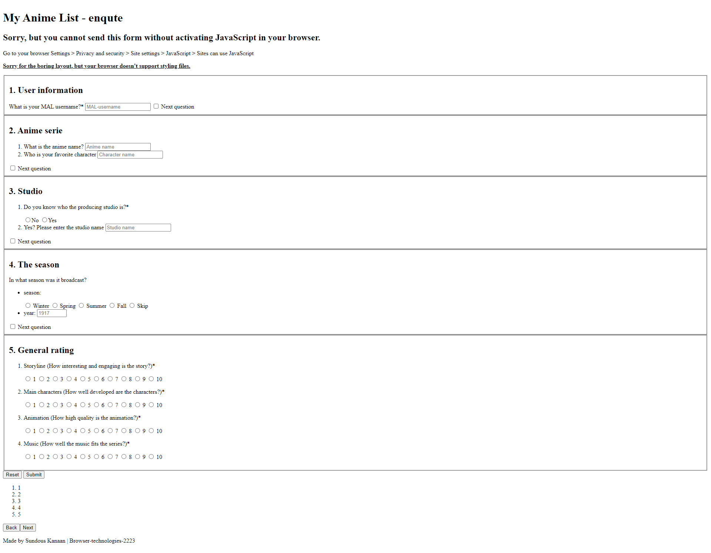
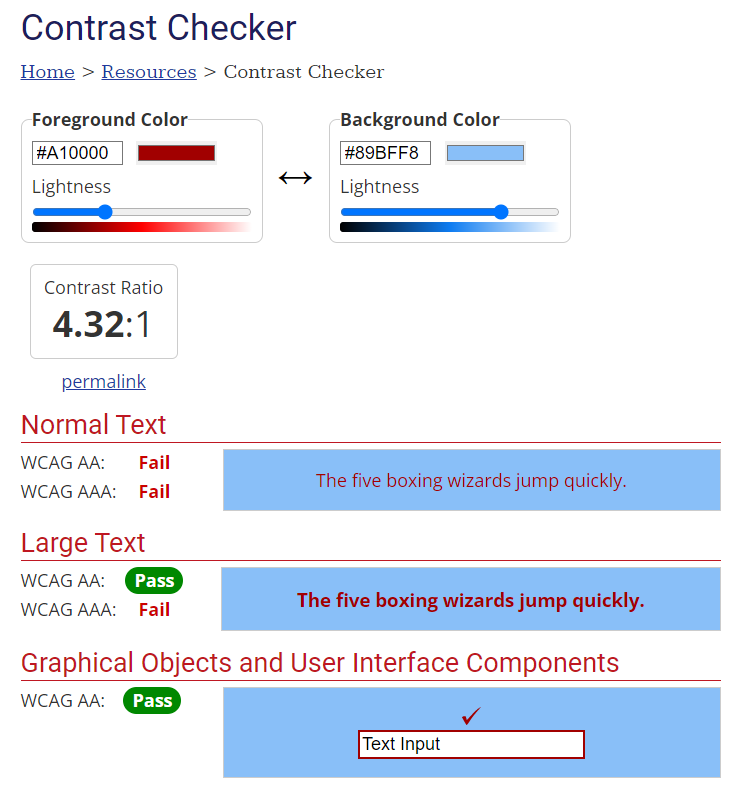

# User story

MyAnimeList - Beoordelingsenquête over anime-serie

Als een anime-fan wil ik een enquête kunnen invullen over mijn favoriete anime-serie met verschillende antwoordmogelijkheden. Ik wil duidelijk zien waar ik ben en hoeveel vragen ik nog moet invullen. Ik wil eerder ingevulde vragen kunnen herzien en eventuele fouten kunnen corrigeren. Als ik de enquête niet afkrijg, wil ik later weer verder kunnen gaan met waar ik gebleven was.

Vereisten voor de enquête:

- Gebruikersgegevens (gebruikersnaam) verplicht

- Per anime-serie:

  - Naam van de anime-serie *
  - Wie is je favoriete character *
- Als hij de studio naam weten *
  - ja? vul de studio naam in.
- In welk seizoen werd uitgezonden? * (met jaar)
- Beoordeling op een schaal van 1-10 voor:
  - Verhaallijn (hoe interessant en boeiend is het verhaal) *
  - Main personages (hoe goed ontwikkeld zijn de personages) *
  - Animatie (hoe hoogwaardig is de animatie) *
  - Muziek (hoe goed past de muziek bij de serie) *

## Opdracht Criteria 

### 1. Validatie: Zorg ervoor dat het formulier compleet wordt ingevuld. Geef duidelijke foutmeldingen. Bedenk zelf wanneer en hoe de validatie zal plaatsvinden. ✅


### 2. Als ik de enquete niet afkrijg, wil ik later weer verder gaan met waar ik ben gebleven. ✅

### 3. Duidelijke interface waarmee gebruiker terug kan naar vorige vragen. (En misschien ook om een vraag over te slaan?) ✅
 
### 4. Duidelijke interface die aangeeft waar je bent in het formulier ✅

### 5. Je mag geen zichtbare radio buttons gebruiken ✅

### 6. Het formulier moet een light mode en dark mode hebben. ✅

## Features test

### 1. HTML
Duidelijk html pagina met twee noteties:
1. Geen JavaScript ondersteunen note.
2. Geen layout styling gepakt note.



### 2. HTML + CSS
Duidelijk em mooie pagina met "Geen JavaScript ondersteunen note" maar de gebruiker kan wel de Enqute invullen en alle vragen zien.


### 3. HTML + CSS + JavaScript
Mooie gewerkte website.


### 4. Slecht Internet
Ik vind dat mijn website werkt goed met een slecht Internet verbinen want de gebruiker moet 1 pagina openen en geen linkijs naar ander pagina die goed internet nodig om te werken.

Normal tijd: 4ms.
Slow 3G loading tijd: 2.03s.


### 5. Custom fonts
Ik heb geen custom fonts in mijn website, omdat sommige browsers ze niet ondersteunen, of het lettertype niet direct verschijnt tijdens het laden van de pagina, is het beter om back-uplettertypen te kiezen die gegarandeerd werken en lijken op de gekozen lettertypestijl.

```
--h1-font: 'Alkatra', cursive, sans-serif;
--text-font: 'Josefin Sans', sans-serif;
```

### 6. Kleuren contrast
Mijn KLeuren contrast was goed maar sommige kleuren niet zoals
:
- De fout melding kleur met de section achtergrond kleur




- De border kleur van de goed ingevuld input


- De Submit knop


### 7. Muis/Trackpad werkt niet
De website kan goed werken door de toetsenbord met een focus animatie.

### 8. Screen reader
Het was interessant om een ​​schermlezer uit te proberen. Waar de secties van het formulier buiten het frame van het scherm waren geplaatst, las de lezer ze ook, dus ik probeerde `visibility: hidden;` en het werkte zoals het hoort, aangezien het `transform` effect bleef werken zoals het zou moeten, en de schermlezer niet ziet langer de rest van de secties behalve het schijnbare schudden.

`visibility: hidden;` i.p.v `display:none` want met de tweede gaat de `transform` niet werken.

---
---

## Brouwsers test

### 1. Chrome
De site is gebouwd met behulp van de Chrome-browser, dus het werkt zoals het hoort zonder problemen.

### 2. Fire Fox
- De Fire Fox support geen `:has()` selectors dus de notetie verschijnt in het pagina.
```
// geen js notetie
body:has(main.carousel) header div {
    display: none;
}
```
- Hij pakt ook geen radio buttons styling, want ik heb de styling met `:has()` gemaakt en `appearance: none;` toegevoegd.

```
appearance: none;
-webkit-appearance: none;
-moz-appearance: none;
```

*Fix?*
- :has()
  -Gebruik jQuery, een populaire JavaScript-bibliotheek, die de :has()-selector ondersteunt.
- main auto class add event
  - class in de html te gebruiken?


### 3. Safari


### 4. Samsung Internet


### 5. UC Browser


### 6. Android


### 7. iphone


## Na Submiten


## Wat zou ik anders doen!
- Ik zou een introductie pagina maken met een korte inleiding over de enquête.
- 